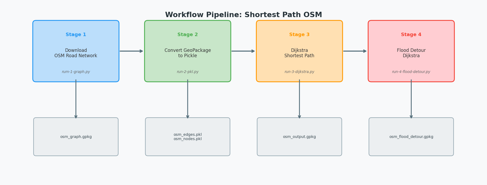
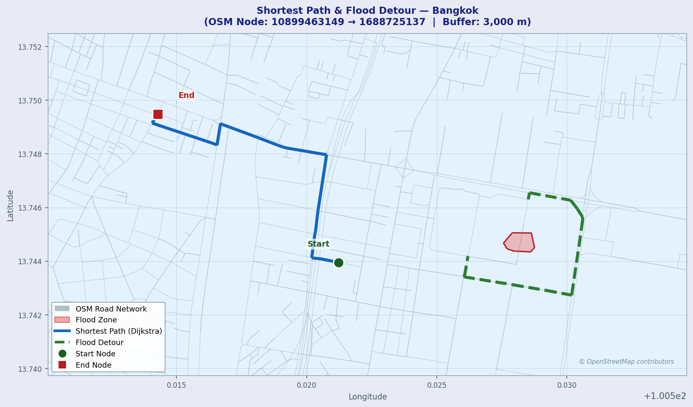

# Shortest Path OSM

การวิเคราะห์เส้นทางสั้นที่สุดบนโครงข่ายถนนจากข้อมูล OpenStreetMap (OSM) โดยใช้ขั้นตอนวิธี Dijkstra พร้อมรองรับการหลีกเลี่ยงพื้นที่น้ำท่วม

---

## โปรเจกต์

โปรเจกต์นี้ดาวน์โหลดข้อมูลโครงข่ายถนนจาก OpenStreetMap บริเวณกรุงเทพมหานคร แล้วคำนวณเส้นทางสั้นที่สุดระหว่าง 2 จุด โดยรองรับการนำเข้า Layer น้ำท่วม (GeoPackage) เพื่อสร้างเส้นทางเลี่ยงแบบ Dynamic

## Workflow Diagram



---

## จุดเริ่มต้นและปลายทาง

| | OSM Node ID | พิกัด (lon, lat) |
|---|---|---|
| ต้นทาง | `10899463149` | 100.5044646, 13.7480028 |
| ปลายทาง | `1688725137` | 100.5546609, 13.7410995 |
| Buffer radius | — | 3,000 เมตร |

---

## โครงสร้างไฟล์

```
shortest-path-osm-1/
├── params.py                  # Config: จุดเริ่มต้น/ปลายทาง, buffer distance
├── rum-1-graph.py             # Stage 1: ดาวน์โหลด OSM → osm_graph.gpkg
├── run-2-pkl.py               # Stage 2: แปลง GeoPackage → pickle (edges/nodes)
├── run-3-dijkstra.py          # Stage 3: Dijkstra + path reconstruction (หลัก)
├── run-3-shortest.py          # Stage 3 (alt): OSMnx built-in shortest path
├── run-4-flood-detour.py      # Stage 4: Dijkstra หลีกเลี่ยงพื้นที่น้ำท่วม
├── flood-1.gpkg               # Layer น้ำท่วม (MultiPolygon, EPSG:4326)
├── osm_edges.pkl              # Pickle: edges GeoDataFrame
├── osm_nodes.pkl              # Pickle: nodes GeoDataFrame
├── osm_output.gpkg            # Output: เส้นทางจาก Dijkstra (layer: dijkstra_v3)
├── osm_output_shortest.gpkg   # Output: เส้นทางจาก OSMnx
├── osm_flood_detour.gpkg      # Output: เส้นทางเลี่ยงน้ำท่วม
├── output.xlsx                # ตารางผลลัพธ์การวิเคราะห์
└── Proj_1.qgz                 # QGIS Project สำหรับแสดงผล
```

---

## การติดตั้ง

```bash
pip install osmnx geopandas pandas shapely pyproj numpy scipy matplotlib openpyxl
```

---

## วิธีใช้งาน (ตามลำดับ)

### Stage 1 — ดาวน์โหลดข้อมูล OSM

```bash
python rum-1-graph.py
```

ผลลัพธ์: `osm_graph.gpkg` (layers: `nodes`, `edges`)

### Stage 2 — แปลงเป็น Pickle

```bash
python run-2-pkl.py
```

ผลลัพธ์: `osm_edges.pkl`, `osm_nodes.pkl`

### Stage 3 — คำนวณเส้นทางสั้นที่สุด (Dijkstra)

```bash
python run-3-dijkstra.py
```

แสดงตาราง Dijkstra และเส้นทาง พร้อมบันทึกผลลัพธ์ไปยัง `osm_output.gpkg` (layer: `dijkstra_v3`)

### Stage 4 — คำนวณเส้นทางเลี่ยงน้ำท่วม

```bash
python run-4-flood-detour.py
```

นำเข้า `flood-1.gpkg` ตรวจหา edges ที่ตัดกับพื้นที่น้ำท่วม แล้วคำนวณเส้นทางใหม่

ผลลัพธ์: `osm_flood_detour.gpkg` (layer: `flood_detour`) พร้อม geometry LINESTRING

---

## โครงสร้างตารางผลลัพธ์

| คอลัมน์ | คำอธิบาย |
|---|---|
| `u` | OSM Node ID ต้นทางของ edge |
| `v` | OSM Node ID ปลายทางของ edge |
| `distance` | ระยะทางของ edge (เมตร) |
| `status` | `T` = ค้นพบใหม่, `F` = เคย visit แล้ว |
| `count_section` | ลำดับขั้นตอนที่ Dijkstra ประมวลผล node นั้น (0 = F) |

---

## ผลการวิเคราะห์

| | เส้นทางปกติ | เส้นทางเลี่ยงน้ำท่วม |
|---|---|---|
| Node ต้นทาง | `10899463149` | `10899463149` |
| Node ปลายทาง | `1688725137` | `1688725137` |
| Output layer | `dijkstra_v3` | `flood_detour` |
| Edge ที่ถูกบล็อก | — | ตรวจจากการ intersect กับ `flood-1.gpkg` |

## แผนที่เส้นทาง



> **สีน้ำเงิน** = เส้นทางสั้นที่สุด (Dijkstra) &nbsp;|&nbsp; **สีเขียวประ** = เส้นทางเลี่ยงน้ำท่วม &nbsp;|&nbsp; **สีแดง** = พื้นที่น้ำท่วม

---

## การแสดงผลใน QGIS

เปิดไฟล์ `Proj_1.qgz` เพื่อดู layer โครงข่ายถนนและเส้นทางที่คำนวณได้บนแผนที่

---

## License

MIT
